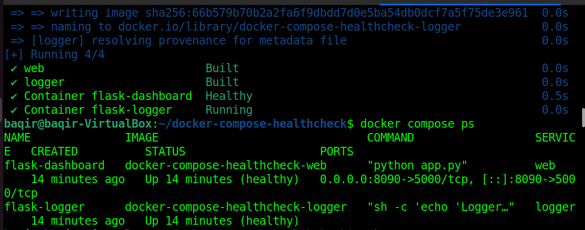
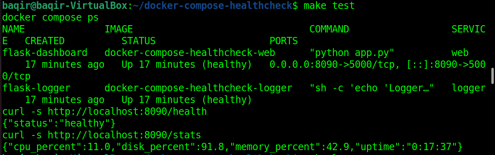
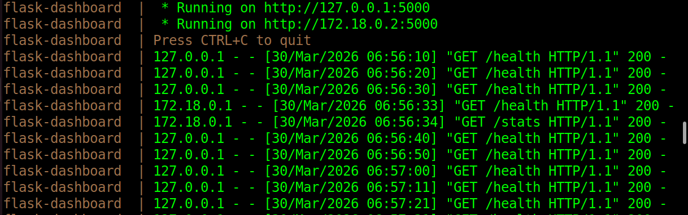
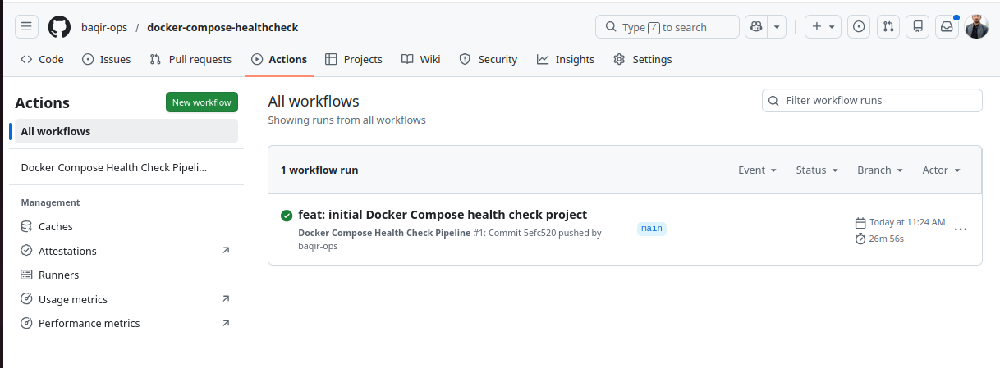
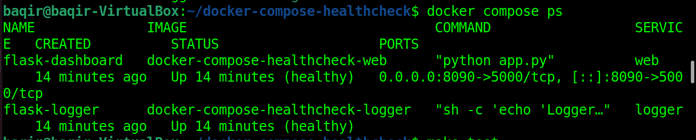

# Docker Compose Health Check Dashboard

> A production-grade multi-container application with automated health
> validation, real-time system monitoring, and a CI/CD pipeline that
> fails fast if any container is unhealthy.

---

## Architecture
```
┌─────────────────────────────────────────┐
│           Docker Compose Stack          │
│                                         │
│  ┌──────────────┐   ┌────────────────┐  │
│  │     web      │   │    logger      │  │
│  │              │   │                │  │
│  │ Flask app    │   │ Sidecar that   │  │
│  │ CPU / Memory │   │ logs every     │  │
│  │ Uptime stats │   │ 10 seconds     │  │
│  │              │   │                │  │
│  │ HEALTHCHECK  │   │ HEALTHCHECK    │  │
│  │ /health      │   │ pgrep sh       │  │
│  │ every 10s    │   │ every 10s      │  │
│  └──────┬───────┘   └───────┬────────┘  │
│         │  depends_on:      │           │
│         │  service_healthy  │           │
└─────────────────────────────────────────┘
           │
     port 8090:5000
```

---

## Pipeline Flow
```
Push to main
      │
      ▼
docker compose up -d --build
      │
      ▼
Wait 20 seconds
      │
      ▼
Check flask-dashboard = healthy ✅
Check flask-logger    = healthy ✅
      │
      ▼
curl /health → {"status": "healthy"}
curl /stats  → cpu, memory, uptime, disk
curl /       → service info
      │
      ▼
docker compose down
      │
      ▼
✅ Pipeline passes
```

---

## Tech Stack

| Tool | Purpose |
|------|---------|
| Docker Compose | Multi-container orchestration |
| Flask + psutil | Web dashboard with system metrics |
| Alpine Linux | Lightweight logger sidecar |
| GitHub Actions | CI/CD pipeline |
| Self-hosted runner | Pipeline runs on Ubuntu VM |

---

## Project Structure
```
docker-compose-healthcheck/
├── app/
│   ├── app.py              # Flask dashboard (CPU, memory, uptime)
│   ├── requirements.txt    # flask, psutil, pytest
│   └── Dockerfile          # Multi-stage build + HEALTHCHECK
├── logger/
│   └── Dockerfile          # Alpine sidecar + HEALTHCHECK
├── docker-compose.yml      # 2 services, healthchecks, depends_on
├── Makefile                # Developer shortcuts
└── .github/
    └── workflows/
        └── pipeline.yml    # CI health validation pipeline
```

---

## Makefile Commands
```bash
make up      # Build and start both containers in background
make down    # Stop and remove all containers
make test    # Show container status + curl all endpoints
make logs    # Follow live logs from both containers
make ps      # Show running containers and ports
```

---

## API Endpoints

| Endpoint | Response |
|----------|----------|
| `GET /` | Service name, status, environment |
| `GET /health` | `{"status": "healthy"}` |
| `GET /stats` | CPU %, memory %, disk %, uptime |

---

## Docker HEALTHCHECK

Both containers have built-in health checks:

**web container:**
```dockerfile
HEALTHCHECK --interval=10s --timeout=5s --retries=3 \
  CMD python -c "import urllib.request; \
  urllib.request.urlopen('http://localhost:5000/health')"
```

**logger container:**
```dockerfile
HEALTHCHECK --interval=10s --timeout=5s --retries=3 \
  CMD pgrep sh || exit 1
```

The logger only starts after web is confirmed healthy:
```yaml
depends_on:
  web:
    condition: service_healthy
```

---

## Screenshots

### Both Containers Healthy


### Health Endpoints Response


### Live Logs Streaming


### GitHub Actions Pipeline Success


### Docker Compose PS


---

## Live Response Examples
```json
GET /health
{"status": "healthy"}

GET /stats
{
  "cpu_percent": 4.6,
  "disk_percent": 91.8,
  "memory_percent": 44.0,
  "uptime": "0:00:27"
}

GET /
{
  "environment": "production",
  "message": "Docker Compose Health Dashboard",
  "status": "running"
}
```

---

## What This Demonstrates

- Multi-container orchestration with Docker Compose
- Container health monitoring with HEALTHCHECK directives
- Service dependency management with `depends_on: condition: service_healthy`
- CI/CD pipeline that automatically validates container health
- Sidecar container pattern used in real microservices
- Makefile for clean developer workflow

---

## Author

**Muhammad Baqir Nawaz** — Junior DevOps Engineer
- GitHub: [@baqir-ops](https://github.com/baqir-ops)
- Docker Hub: [baqirops](https://hub.docker.com/u/baqirops)
- Location: Dera Ghazi Khan, Punjab, Pakistan
